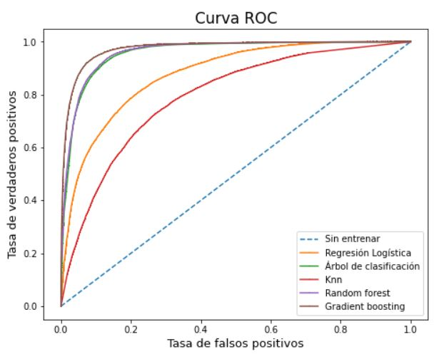
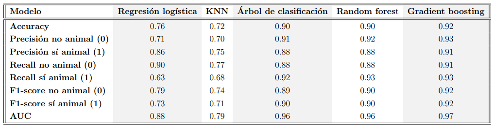
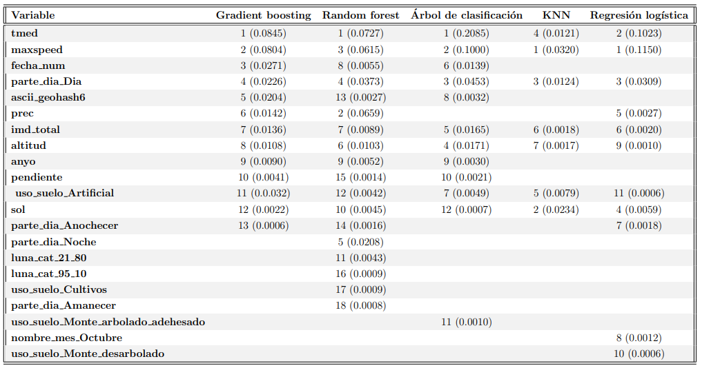

<h1 align="center"> Análisis y modelización predictiva de accidentes de tráfico con animales involucrados en vías interurbanas de España</h1>

<H3  align="center">Alba Gómez Varela</H3>

  

      
          
          
          
      
  

  

    
    
    
    
      
  

## El proyecto

Este repositorio forma parte del Trabajo Final de Máster 'Análisis y modelización predictiva de accidentes de tráfico con animales involucrados en vías interurbanas de España' del **Máster Universitario de Ciencia de Datos** de la Universitat Oberta de Catalunya (UOC). 

La aplicación de tecnologías relacionadas con la Ciencia de Datos a los conjuntos de datos abiertos disponibles abre un nuevo camino a la resolución de problemas no planteados hasta la fecha o cuyas propuestas para ser abordados se pueden mejorar. En consecuencia, el beneficio que se puede aportar a la sociedad gracias a técnicas de **aprendizaje automático** (*machine learning*), entre otras, es exponencial en muy diferentes ámbitos. 

Una de las áreas por explorar más en profundidad es la de la **seguridad vial** en España. No obstante, cabe destacar que se están dando pasos acelerados en los últimos años gracias a inversiones de recursos en iniciativas como la plataforma DGT 3.0 y las normativas sobre coche conectado que, a su vez, generarán un volumen mayor de datos.

Este trabajo pretende extraer el mayor conocimiento posible de los datos existentes sobre **accidentes de tráfico en España en los que hay animales involucrados**. Mediante la creación de modelos que identifican zonas de riesgo en función del contexto, se confirma que se pueden **predecir y generar una metodología** para ello. Los buenos resultados, con un 92\% de exactitud y más de 91\% de rendimiento en el resto de métricas, muestran que el camino iniciado en este proyecto podría ser una vía de investigación e implementación a seguir. 

Por ello, para fomentar el **trasvase de conocimiento** entre el mundo académico y la sociedad, se genera y entrega la documentación oportuna sobre los modelos y otros hallazgos que faciliten su despliegue en la plataforma DGT 3.0. Además, se publican el código, las herramientas y los conjuntos de datos generados durante el proceso bajo una licencia abierta, lo que permite compartirlos con toda la comunidad científica. 

Este repositorio, por tanto, constituye la última parte del proyecto y, para **reproducir el trabajo completo en otros entornos**, se pueden seguir los pasos detallados en **[la memoria del TFM](AlbaGomezVarela_TFM.pdf)**.

## Resultados

Los resultados obtenidos son muy buenos, siendo el mejor modelo el **gradient boosting**. Esto se observa en la comparativa de las curvas ROC.

Esta conclusión se confirma analizando diferentes métricas de todos los modelos, siendo el **gradient boosting** el algoritmo que desempeña un mayor rendimiento en todas ellas:

También es muy importante la detección de las **variables más influyentes** en los modelos debido a la integración de fuentes de datos de muy diversa naturaleza. A continuación se muestran las que tienen un peso igual o superior a 0.001 en el redondeo a tres decimales.

## Conjuntos de datos y proyectos generados 

El enlace del **DOI** de Zenodo a los *datasets* generados son los siguientes:

- [Microdatos enriquecidos de accidentes con víctimas en España entre 2016 y 2021](https://doi.org/10.5281/zenodo.7523402).
- [Microdatos enriquecidos de accidentes con animales en España entre 2016 y 2021](https://doi.org/10.5281/zenodo.7523379).
- [Modelo digital del terreno (MDT) completo con la probabilidad de accidente por cada especie animal en función del modelo Kernel Density](https://doi.org/10.5281/zenodo.7522024).
- [Shapefile del mapa forestal alrededor de las carreteras interurbanas de España](https://doi.org/10.5281/zenodo.7522758).
- [Distribución en España de cada especie animal involucrada en un accidente de tráfico](https://doi.org/10.5281/zenodo.7523015).

Además, se han desarrollado **dos proyectos** en plataformas diferentes para fases diferentes de este trabajo:
- [Proyecto en RPubs con la fase de análisis de los accidentes de tráfico con animales entre 2016 y 2021 en España](https://rpubs.com/alba_gvarela/animal_car_accident_analysis).
- [Proyecto en Tableu Public de visualización interactiva de todos los accidentes de tráfico con víctimas entre 2016 y 2021 en España](https://public.tableau.com/app/profile/alba.gomez.varela/viz/accidentes_trafico_2016_2021/Accidentes).

## Herramientas desarrolladas

Para solventar algunos de los obstáculos surgidos, se han desarrollado herramientas que se publican en este repositorio para facilitar trabajos futuros a cualquier persona interesada. Las más innovadoras son las siguientes:

- [elevations](https://github.com/alba620/analisis-prediccion-accidentes-trafico-animales/tree/master/src/elevations). Herramienta para hallar la altitud de cualquier punto de España.
- [slopes](https://github.com/alba620/analisis-prediccion-accidentes-trafico-animales/tree/master/src/slopes). Herramienta para calcular la mediana de la pendiente alrededor de 30 metros de cualquier punto de España.
- [land](https://github.com/alba620/analisis-prediccion-accidentes-trafico-animales/tree/master/src/land). Herramienta que permite la creación de capas de usos del suelo, en este caso en un buffer alrededor de las vías interurbanas. 

## Estructura

A continuación, se muestra el árbol de la estructura del repositorio en detalle:

    .
    ├── img                       # imágenes con los resultados de los modelos
    |   ├── all_results.PNG                                     
    |   ├── roc_results.JPG                               
    |   └── variable_results.PNG  
    | 
    ├── models                    # código para el dataset final y generación de modelos
    |   |
    |   ├── elevations            # cálculo e integración de alturas de registros no verdaderos
    |   |   ├── elevationsdb.py                   
    |   |   ├── models.py                           
    |   |   └── utils.py                   
    |   |
    |   ├── imd                   # cálculo e integración de imd de registros no verdaderos
    |   |   ├──imdsdb.py                   
    |   |   └── utils.py                   
    |   |
    |   ├── land                  # cálculo e integración de uso del suelo de registros no verdaderos
    |   |   ├──landusedb.py                 
    |   |   └── utils.py               
    |   |
    |   ├── maxspeed              # cálculo e integración de velocidad máxima de registros no verdaderos
    |   |   ├──maxspeeddb.py                  
    |   |   └── utils.py                   
    |   |
    |   ├── meteo                 # cálculo e integración de datos meteorológicos de registros no verdaderos
    |   |   ├──docs                  
    |   │   │   ├── AEMET OpenData.postman_collection.json
    |   │   │   ├── AvisosCapApi.md
    |   │   │   ├── IndicesIncendiosApi.md
    |   │   │   ├── InformacionSateliteApi.md
    |   │   │   ├── MaestroApi.md
    |   │   │   ├── MapasYGraficosApi.md
    |   │   │   ├── Model200.md
    |   │   │   ├── Model401.md
    |   │   │   ├── Model404.md
    |   │   │   ├── Model429.md
    |   │   │   ├── ObservacionConvencionalApi.md
    |   │   │   ├── PrediccionMaritimaApi.md
    |   │   │   ├── PrediccionesEspecificasApi.md
    |   │   │   ├── PrediccionesNormalizadasTextoApi.md
    |   │   │   ├── ProductosClimatologicosApi.md
    |   │   │   ├── RedesEspecialesApi.md
    |   │   │   └── ValoresClimatologicosApi.md
    |   |   ├── aemetdb.py    
    |   |   ├── meteohisdb.py    
    |   |   ├── models.py     
    |   |   └── utils.py                   
    |   |   
    |   ├── moonlight             # cálculo e integración de la superficie de la luna iluminada
    |   |   ├──moonlightdb.py                 
    |   |   └── utils.py                   
    |   |
    |   ├── partofday             # cálculo e integración de parte del día de registros no verdaderos
    |   |   ├── partofdaydb.py                  
    |   |   └── utils.py                   
    |   |
    |   ├── slopes                # cálculo e integración de la pendiente de registros no verdaderos
    |   |   ├── models.py                  
    |   |   ├── slopesdb.py      
    |   |   └── utils.py                   
    |   |
    |   ├── sql                   # sentencias y scripts sql para esta fase
    |   |   ├── accidentes_no.sql                  
    |   |   ├── accidentes_victimas_accidentes_no.sql      
    |   |   ├── creacion_datos.sql                
    |   |   ├── ceeacion_puntosaccidentes.sql
    |   |   ├── dia_mes_anyo.sql      
    |   |   ├── fecha_hora_accidente.sql                
    |   |   ├── procesado_accidentes_no.sql
    |   |   └── puntos_accidentes.py                   
    |   |
    |   └── models.ipynb          # fase completa de modelización predictiva y evaluación
    | 
    ├── src                       # código para el dataset de accidentes de tráfico con animales y su análisis
    |   |
    |   ├── elevations            # cálculo e integración de alturas de registros reales                 
    |   |   ├── elevationsdb.py                   
    |   |   ├── models.py                   
    |   |   └── utils.py                   
    |   |
    |   ├── kde                   # kernel density estimation                 
    |   |   ├── kde.py               
    |   |   ├── kde3d.py                      
    |   |   └── kde_maps.py         
    |   |
    |   ├── land                  # cálculo e integración de uso del suelo de registros reales          
    |   |   ├── landbuffer.py
    |   |   ├── landusedb.py              
    |   |   └── utils.py              
    |   |
    |   ├── maxspeed              # cálculo e integración de velocidad máxima de registros reales         
    |   |   ├──maxspeeddb.py                
    |   |   └── utils.py                
    |   |
    |   ├── meteo                 # cálculo e integración de datos meteorológicos de registros reales                
    |   |   ├──docs          
    |   │   │   ├── AEMET OpenData.postman_collection.json
    |   │   │   ├── AvisosCapApi.md
    |   │   │   ├── IndicesIncendiosApi.md
    |   │   │   ├── InformacionSateliteApi.md
    |   │   │   ├── MaestroApi.md
    |   │   │   ├── MapasYGraficosApi.md
    |   │   │   ├── Model200.md
    |   │   │   ├── Model401.md
    |   │   │   ├── Model404.md
    |   │   │   ├── Model429.md
    |   │   │   ├── ObservacionConvencionalApi.md
    |   │   │   ├── PrediccionMaritimaApi.md
    |   │   │   ├── PrediccionesEspecificasApi.md
    |   │   │   ├── PrediccionesNormalizadasTextoApi.md
    |   │   │   ├── ProductosClimatologicosApi.md
    |   │   │   ├── RedesEspecialesApi.md
    |   │   │   └── ValoresClimatologicosApi.md
    |   |   ├── aemetdb.py    
    |   |   ├── meteohisdb.py    
    |   |   ├── models.py     
    |   |   └── utils.py                  
    |   |   
    |   ├── moonlight             # cálculo e integración de la superficie de la luna iluminada
                        
    |   |   ├──moonlightdb.py                   
    |   |   └── utils.py                  
    |   |
    |   ├── partofday             # cálculo e integración de parte del día de registros reales                     
    |   |   ├── partofdaydb.py                  
    |   |   └── utils.py                  
    |   |
    |   ├── pk2loc                # cálculo e integración de la longitud y latitud de cada accidente           
    |   |   ├── models.py                  
    |   |   ├── pk2loc.py      
    |   |   └── pk2locdb.py                  
    |   |
    |   ├── scrapeimd             # scraping de todos los imd de España e integración en los registros reales                      
    |   |   ├──docs               
    |   │   │   ├── IMD.postman_collection.json
    |   │   │   └── response_example.json  
    |   |   ├── imdsdb.py                  
    |   |   ├── pk2loc.py      
    |   |   ├── scrapeimd.py   
    |   |   └── utils.py                  
    |   |
    |   ├── slopes                # cálculo e integración de la pendiente de registros reales                   
    |   |   ├── models.py                
    |   |   ├── slopesdb.py      
    |   |   └── utils.py                 
    |   |
    |   ├── sql                   # sentencias y scripts sql para esta fase               
    |   |   ├── creacion_accidentes_animales_final.sql             
    |   |   ├── creacion_accidentes_solo_animales.sql      
    |   |   ├── creacion_datos.sql               
    |   |   ├── creacion_accidentes_solo_animales_decodificado.sql
    |   |   ├── creacion_aemet_estaciones.sql    
    |   |   ├── creacion_animales_gbif.sql            
    |   |   ├── creacion_buffer_mapa_forestal.sql
    |   |   ├── creacion_calculo_dia_semana.sql               
    |   |   ├── creacion_carreteras.sql
    |   |   ├── creacion_imds.sql   
    |   |   ├── creacion_importacion_provincias.sql     
    |   |   ├── creacion_mapa_forestal.sql
    |   |   ├── creacion_mapa_forestal_carreteras.sql
    |   |   ├── creacion_meteohis.sql
    |   |   ├── creacion_mtn50.sql             
    |   |   ├── creacion_mtn50_hojas_alturas.sql
    |   |   ├── creacion_mtn50_hojas_pendientes.sql          
    |   |   ├── creacion_roads_osm.sql
    |   |   ├── creacion_roads_tfm_maxspeed_infered.sql  
    |   |   ├── dia_semana_tipo_dia.sql           
    |   |   └── geom_buff_animales_gbif.sql            
    |   |
    |   └── animal-road-accidents-analysis.rmd       # análisis de accidentes de tráfico con animales
    |
    ├── LICENSE                   # licencia del código
    |                                                   
    └── README.md                 # descripción del repositorio
